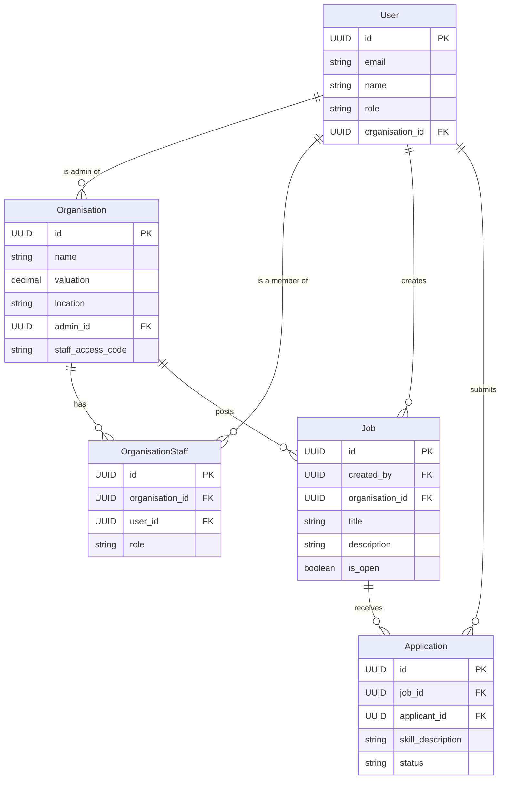

# HR Base API

HR Base is a Django REST Framework application that brings job seekers and employers together. It allows companies to post vacancies while enabling job seekers to apply for these openings.

## Features

- User authentication and authorization
- Organization creation and management
- Job posting and application submission
- Role-based access control (User, Org Admin, Org HR, Org Staff)

## Database Schema

Below is a visual representation of the database schema, showing the relationships between tables:



This diagram shows the following relationships:
- User to Organisation: One-to-Many (A user can be an admin of one organization)
- User to OrganisationStaff: One-to-Many (A user can be a staff member in multiple organizations)
- User to Job: One-to-Many (A user can create multiple jobs)
- User to Application: One-to-Many (A user can submit multiple applications)
- Organisation to OrganisationStaff: One-to-Many (An organization can have multiple staff members)
- Organisation to Job: One-to-Many (An organization can post multiple jobs)
- Job to Application: One-to-Many (A job can receive multiple applications)

## Prerequisites

- Python 3.8+
- pip
- Docker
- Docker Compose
- PostgreSQL (or your preferred database)

## Setup Instructions

1. Clone the repository:
   ```
   git clone https://github.com/Moshood-Wale/HR-base-system.git
   cd HR-base-system
   ```

2. Create a `.env` file in the project root and add the necessary environment variables as specified in the 
   .env.sample file.:

3. Build and start the Docker containers:
   ```
   docker-compose up --build
   ```
   This command will build the Docker images and start the containers for the web application and the database.

4. In a new terminal, run the database migrations:
   ```
   docker-compose exec api python manage.py migrate
   ```

5. Create a superuser:
   ```
   docker-compose exec web python manage.py createsuperuser
   ```

The API should now be accessible at `http://localhost:8000/api/v1/`.

## API Documentation

API documentation is available at `http://127.0.0.1:8000/api/v1/doc/#/` when the server is running.

## Development Workflow

1. To start the development server:
   ```
   docker-compose up
   ```

2. To run a command in the container:
   ```
   docker-compose exec api [command]
   ```
   For example, to open a Python shell:
   ```
   docker-compose exec api python manage.py shell
   ```

3. To stop the containers:
   ```
   docker-compose down
   ```

## Deployment

The deployment is done on Digital Ocean. 

The API should now be accessible at `http://localhost:8000/api/v1/`.

## API Documentation

API documentation is available at `http://127.0.0.1:8000/api/v1/doc/#/` when the server is running.

## License

This project is licensed under the MIT License - see the [LICENSE.md](LICENSE.md) file for details.